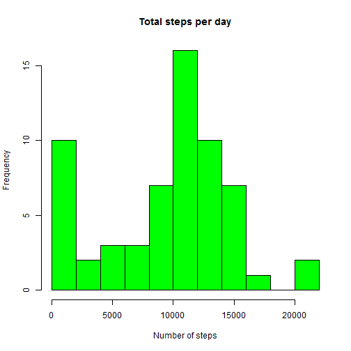
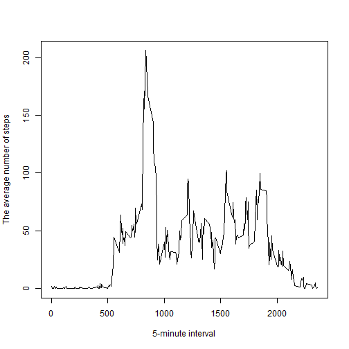
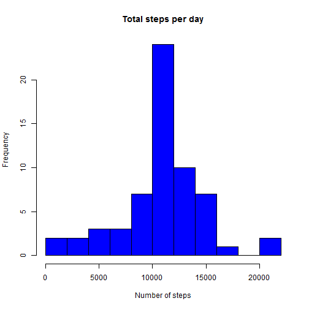
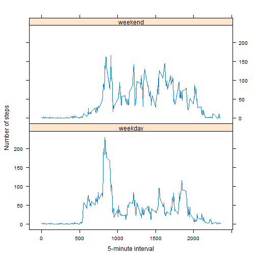

## This is the first assignment in the course "Reproducible Research"

This assignment makes use of data from a personal activity monitoring device. This device collects data at 5 minute intervals through out the day. The file *activity.csv* contains the data for this assignment. There are a total of 17,568 observations in this dataset. The variables are: **steps** (Number of steps taking in a 5-minute interval), **date** (The date on which the measurement was taken: during October and November 2012) and **interval** (Identifier for the 5-minute interval in which measurement was taken).

Please, install the packages *knitr*, *dplyr* and *lattice* and check that the file *activity.csv* is in your working directory. 


First, we load the data. 


```r
data <- read.csv("activity.csv")
summary(data)
```

```
##      steps                date          interval     
##  Min.   :  0.00   2012-10-01:  288   Min.   :   0.0  
##  1st Qu.:  0.00   2012-10-02:  288   1st Qu.: 588.8  
##  Median :  0.00   2012-10-03:  288   Median :1177.5  
##  Mean   : 37.38   2012-10-04:  288   Mean   :1177.5  
##  3rd Qu.: 12.00   2012-10-05:  288   3rd Qu.:1766.2  
##  Max.   :806.00   2012-10-06:  288   Max.   :2355.0  
##  NA's   :2304     (Other)   :15840
```

The first question is: **What is mean total number of steps taken per day?**

Here is a histogram of the total number of steps taken each day.


```r
library(dplyr)
by_date <- group_by(data, date)
numstep <- summarize(by_date, sum(steps, na.rm = TRUE))
names(numstep) <- c("date", "total_steps")
hist(numstep$total_steps, col = "green", main = "Total steps per day", xlab = "Number of steps", breaks = 10)
```

 

Calculations of the mean and median total number of steps taken per day:


```r
mean(numstep$total_steps, na.rm = TRUE)
```

```
## [1] 9354.23
```

```r
median(numstep$total_steps, na.rm = TRUE)
```

```
## [1] 10395
```

The second question is: **What is the average daily activity pattern?**

Here is a time series plot of the 5-minute interval (x-axis) and the average number of steps taken, averaged across all days (y-axis).


```r
by_interval <- group_by(data, interval)
avstep <- summarize(by_interval, mean(steps, na.rm = TRUE))
names(avstep) <- c("interval", "average_steps")
plot(avstep$interval, avstep$average_steps, type = "l", xlab = "5-minute interval", ylab = "The average number of steps")
```

 

Maximum number of steps and corresponding 5-minute interval (on average across all the days in the dataset):


```r
max(avstep$average_steps) 
```

```
## [1] 206.1698
```

```r
as.numeric(avstep[avstep$average_steps == max(avstep$average_steps), 1])
```

```
## [1] 835
```

**Imputing missing values**

The total number of missing values in the dataset:


```r
sum(is.na(data$steps))
```

```
## [1] 2304
```

We will replace all the missing values with the mean for corresponding 5-minute interval and create a new dataset that is equal to the original dataset but with the missing data filled in.


```r
data2 <- data
for(i in 1:17568) {
        if(is.na(data2[i, 1])) {
                data2[i, 1] <- avstep[avstep$interval == data2[i, 3], 2]
        }
}
```

A histogram of the total number of steps taken each day for the new dataset:


```r
by_date2 <- group_by(data2, date)
numstep2 <- summarize(by_date2, sum(steps))
names(numstep2) <- c("date", "total_steps")
hist(numstep2$total_steps, col = "blue", main = "Total steps per day", xlab = "Number of steps", breaks = 10)
```

 

The mean and median total number of steps taken per day:


```r
mean(numstep2$total_steps)
```

```
## [1] 10766.19
```

```r
median(numstep2$total_steps)
```

```
## [1] 10766.19
```

We get values that differ from the values from the first part of the assignment.
As we replace NAs, we added a lot of values with the mean for appropriate 5-minute intervals. Therefore, we "moved" median towards the value of the mean. The presence of NAs introduced bias into summaries of the data.

The last question is: **Are there differences in activity patterns between weekdays and weekends?**

In this code we use Sys.setlocale to set language to English. We created a new factor variable *day_factor* in the dataset with two levels – “weekday” and “weekend” indicating whether a given date is a weekday or weekend day.


```r
Sys.setlocale("LC_TIME", "C")
```

```
## [1] "C"
```

```r
data2$date <- as.Date(data2$date)
data2$day_factor <- weekdays(data2$date)
data2$day_factor <- gsub("Monday", "weekday", data2$day_factor)
data2$day_factor <- gsub("Tuesday", "weekday", data2$day_factor)
data2$day_factor <- gsub("Wednesday", "weekday", data2$day_factor)
data2$day_factor <- gsub("Thursday", "weekday", data2$day_factor)
data2$day_factor <- gsub("Friday", "weekday", data2$day_factor)
data2$day_factor <- gsub("Saturday", "weekend", data2$day_factor)
data2$day_factor <- gsub("Sunday", "weekend", data2$day_factor)

data2$day_factor <- as.factor(data2$day_factor)
```

We made a panel plot containing a time series plot of the 5-minute interval (x-axis) and the average number of steps taken, averaged across all weekday days or weekend days (y-axis):


```r
library(lattice)
by_interval2 <- group_by(data2, interval, day_factor)
avstep2 <- summarize(by_interval2, mean(steps))
names(avstep2) <- c("interval", "day_factor", "average_steps")
     
xyplot(average_steps ~ interval|day_factor, avstep2, type = "l", xlab = "5-minute interval", ylab = "Number of steps", layout = c(1, 2))
```

 
